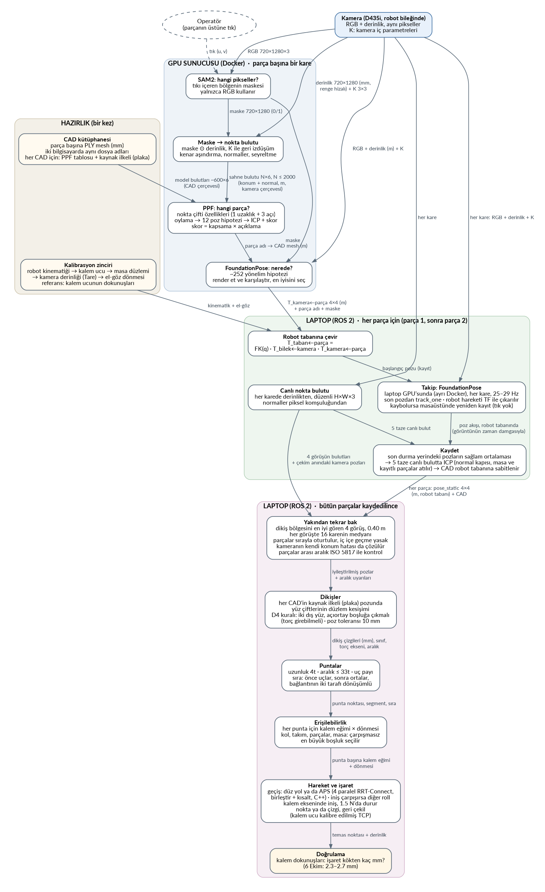

# Pipeline haritası: parçayı koymaktan punta işaretine

Her balon bir işlem, her ok o işlemin bir sonrakine taşıdığı veri.

*(Görüntünün kaynağı `pipeline_map.dot`. Değiştirince
`dot -Tpng -Gdpi=110 pipeline_map.dot -o pipeline_map.png` ile yeniden üretilir.)*

| balon | ne yapıyor | aldığı | verdiği |
|---|---|---|---|
| **CAD kütüphanesi** | Her parçanın üçgen ağı. Bir kez hazırlanıyor: yüzeyden örneklenen model bulutu (PPF için) ve parçanın kaynak ilkeli (plaka, dikiş hesabı için). | PLY mesh (mm) | model bulutları ~600×6 (CAD çerçevesi), CAD mesh, kaynak ilkeli |
| **Kalibrasyon zinciri** | Kameranın gördüğü noktayı robotun anlayacağı yere taşıyan dönüşümleri ölçüyor. Sırasıyla: robot kinematiği, kalem ucu, masa düzlemi, kamera derinliği (Tare), el-göz dönmesi. Referans robotun kendisi, yani kalem ucunun dokunuşları. | kalem dokunuşları, robot eklem açıları | kinematik, el-göz dönüşümü, masa düzlemi, kalem ucu |
| **Kamera** | Robotun bileğindeki D435i. Derinlik, renk görüntüsünün piksellerine hizalı. | sahne | RGB 720×1280×3, derinlik 720×1280 (mm), K 3×3 |
| **Operatör** | Parçanın üstüne tıklayarak hangi nesnenin kastedildiğini söylüyor. | – | tık (u, v) |
| **SAM2: hangi pikseller?** | Tıkı içeren sürekli bölgenin maskesini çıkarıyor. Yalnızca RGB kullanıyor; negatif tık taşan yeri oyuyor. | RGB + tık | maske 720×1280 (0/1) |
| **Maske → nokta bulutu** | Maske ⊙ derinlik; her pikseli K ile 3B'ye geri izdüşürüyor (`X = (u−cx)·Z/fx`, `Y = (v−cy)·Z/fy`). Kenarı aşındırıyor, normalleri hesaplıyor, seyreltiyor. | maske, derinlik, K | sahne bulutu N×6, N ≤ 2000: konum + normal, m, kamera çerçevesi |
| **PPF: hangi parça?** | İki nokta ve normalleri 4 sayı veriyor (1 uzaklık + 3 açı); bu sayılar poza bağlı değil. Sahnedeki çiftler her CAD'in tablosunda aranıp oy topluyor. En çok oylu 12 poz ICP ile düzeltiliyor ve kapsama × açıklama ile puanlanıyor. En yüksek skor kazanıyor. | sahne bulutu, model bulutları | parça adı, skor tablosu, margin |
| **FoundationPose: nerede?** | ~252 yönelim hipotezi üretiyor. Her birinde CAD'i render edip gerçek görüntüyle karşılaştırıyor ve düzeltiyor. En iyi puanlıyı seçiyor. | RGB, derinlik (m), K, maske, seçilen CAD | T_kamera←parça 4×4 (m) |
| **Robot tabanına çevir** | `T_taban←parça = FK(q) · T_bilek←kamera · T_kamera←parça`. Kamera robotla hareket ettiği için her şey robot tabanında tutuluyor. | poz, eklem açıları, el-göz | T_taban←parça 4×4 (m) |
| **Canlı nokta bulutu** | Her kamera karesinden düzenli bir bulut (H×W×3). Normaller piksel komşuluğundan. Kaydetmedeki ICP ve yakın bakış bu bulutu kullanıyor (takip FoundationPose'a RGB + derinlik gönderiyor). | derinlik, K | bulut H×W×3 (m, kamera çerçevesi) |
| **Takip: FoundationPose** | Parça elle yerine taşınırken her karede poz. Laptop'un GPU'sunda ayrı bir Docker'da (`fp_track_server.py`): son pozdan `track_one`, 25–29 Hz, kareden poza 70–90 ms. Robotun kendi hareketi her karenin zaman damgasındaki TF ile çıkarılıyor. Kaybolursa son pozdan çizilen maskeyle masaüstünde yeniden kayıt (tık yok). | kayıt pozu, her kare RGB + derinlik + K | poz akışı (robot tabanında, görüntünün zaman damgasıyla) |
| **Kaydet** | Parça durunca son durma yerine ait pozların sağlam ortalaması (medyan konum, ortalama dönme, sıçrayan kareler atılır). Sonra bu pozdan başlayarak 5 taze canlı bulutta ICP: normal kapısı (arka yüz eşleşmez), masa ve kayıtlı parçalar atılır. Uyum ≥ 0.2 ve düzeltme ≤ 20 mm / 8° ise kullanılır. Takip "şu an nerede"yi, kaydetme "tam olarak nerede"yi söyler. CAD'i bu pozda robot tabanına sabitliyor. | poz akışı, 5 canlı bulut | pose_static 4×4 (m, robot tabanı) + CAD |
| **Yakından tekrar bak** | Dikiş bölgesini en iyi gören 4 görüşü seçiyor (0.40 m, 45°/60°). Her görüşte 16 karenin medyanını alıyor. Parçaları sırayla bütün görüşlere oturtuyor; iç içe geçme yasak. Görüşlerin anlaşmazlığından kameranın kendi konum hatasını bulup çıkarıyor. Parçalar arası aralığı ISO 5817'ye göre kontrol edip aşılırsa uyarıyor. | kaydedilmiş pozlar ve CAD'ler, 4 görüşün bulutları ve çekim anındaki kamera pozları | iyileştirilmiş pozlar, aralık uyarıları |
| **Dikişler** | Her parçanın kaynak ilkelini pozuna koyuyor; yüz çiftlerinin düzlem kesişimini hesaplıyor. D4 kuralı: iki dış yüz olmalı ve açıortayları boşluğa çıkabilmeli, yani torç girebilmeli. Poz toleransı 10 mm. Dikiş görüntüde aranmıyor, CAD'lerden hesaplanıyor. | iyileştirilmiş pozlar, kaynak ilkelleri | dikiş çizgileri (mm, robot tabanı), sınıf, torç ekseni, aralık |
| **Puntalar** | Kalınlığa göre kural (t = ince parça): uzunluk 4t, aralık en fazla 33t, uçlardan pay. Sıra: önce uçlar, sonra ortalar, bağlantının iki tarafı dönüşümlü. Örnek: 8 mm plaka, 250 mm dikiş → 2 punta, 32 mm uzunluk. | dikişler | punta noktası, segment, sıra (mm) |
| **Erişilebilirlik** | Her punta için kalem eğimi × dönmesi kombinasyonlarını, hep aynı kol duruşunda deniyor. Kol, takım, parçalar ve masa çarpışmasız olmalı; en büyük boşluk seçiliyor. | puntalar, parçalar, takım modeli | punta başına kalem eğimi ve dönmesi |
| **Hareket ve işaret** | Puntalar arası geçiş: düz yol, değilse OMPL'in AnytimePathShortening'i (APS): 4 paralel RRT-Connect, yolların en iyi parçaları birleştirilip kısaltılıyor (C++'a taşınmış çarpışma modeliyle, 1 s). Köşeler spline ile yuvarlatılıp TOTG ile zamanlanıyor. İniş raporun kalem dönmesinde çarpışırsa diğer dönmeler deneniyor. Kalem ekseni boyunca iniş, kuvvet 1.5 N olunca duruyor. Nokta ya da çizgi, sonra geri çekiliyor. | kalem açıları, eklemler, kuvvet sensörü | temas noktası ve derinliği |
| **Doğrulama** | İşaretin kökten uzaklığını kalem dokunuşlarıyla, kameradan bağımsız ölçüyor. 6 Ekim: bütün puntalar 2.3–2.7 mm içinde (FoundationPose takibi + kaydetmede ICP + APS). | temaslar, kayıtlı yüzler | hata (mm) |

Ayrıntılar: algılama tarafı [perception_aciklama.md](perception_aciklama.md), robot tarafı
[admitans kontrol açıklama.md](<admitans kontrol açıklama.md>).
