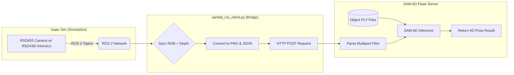

# Data Flow from Isaac Sim to SAM-6D Flask Server

This document explains the process of capturing RGB-D data within an Isaac Sim 5.1 simulation environment (using a modified Realsense RSD455 camera configuration) and transmitting it to a SAM-6D inference server.

## 1. Simulation Environment Setup
The core of the data generation happens in **Isaac Sim**. To simulate a real-world sensor:
*   **Camera Configuration:** A Realsense RSD455 camera is used. However, its intrinsic parameters are modified within the simulation to match an **RSD435i** sensor.
*   **Intrinsics Management:** The `camera.json` file stores these precise intrinsic values (calibration matrix $K$ and depth scale). This ensures that the inference server knows exactly how to project 2D pixels back into 3D space.

## 2. Data Capture via ROS 2 (`sam6d_ros_client.py`)
The `sam6d_ros_client.py` node acts as the bridge between the simulation/ROS 2 ecosystem and the web-based inference server.

### Step A: Subscription and Synchronization
*   The node subscribes to two main ROS 2 topics:
    *   `/camera/color/image_raw` (RGB)
    *   `/camera/depth/image_rect_raw` (Depth)
*   **Synchronization Logic:** Because RGB and Depth frames might arrive at slightly different times, the node implements a `_maybe_process_pair` method. It checks the timestamp difference between the latest RGB and Depth messages using `stamp_to_nanoseconds`. Only if the delta is within `max_sync_delta_sec` (e.g., 0.25s) does it proceed to processing. This prevents "ghosting" where depth from one moment is paired with color from another.

### Step B: Image Processing and Normalization
Once a synchronized pair is found:
1.  **Conversion:** ROS `Image` messages are converted into `numpy` arrays using `image_msg_to_numpy`.
2.  **Color Normalization:** The RGB image is normalized to a standard `BGR8` format (via OpenCV) to ensure consistency regardless of the input encoding.
3.  **Depth Normalization:** The depth image is processed to handle various encodings (like 16-bit unsigned or 32-bit float). It also reconciles the depth scale based on the information in `camera.json`.

### Step C: File Persistence
The processed images are saved locally to a `transfer_dir` (e.g., `scripts/rgb_depth_to_send/`) as:
*   `rgb.png`: The processed color frame.
*   `depth.png`: The processed depth frame.
*   `camera.json`: A freshly updated JSON containing the current camera intrinsics.

## 3. Transmission via HTTP POST (Multipart/Form-Data)
The client uses a standard `multipart/form-data` HTTP request to send all necessary components to the Flask server in a single atomic operation.

### The Payload Structure
The `encode_multipart_formdata` function constructs a request body containing:
*   **File 1: `rgb`**: The binary content of `rgb.png`.
*   **File 2: `depth`**: The binary content of `depth.png`.
*   **File 3: `camera`**: The text/JSON content of the updated `camera.json`.

### Server-Side Processing
The Flask server receives this request and performs the following:
1.  Parses the multipart files.
2.  Loads the RGB and Depth images into memory.
3.  Reads the `camera.json` to understand the projection matrix.
4.  **Object Matching:** Since `.ply` files of the target objects are already present in the server's directory, the server uses the visual features from the incoming images and the geometry from the PLY files to perform 6D pose estimation using the SAM-6D model.

## Summary Flow Diagram

